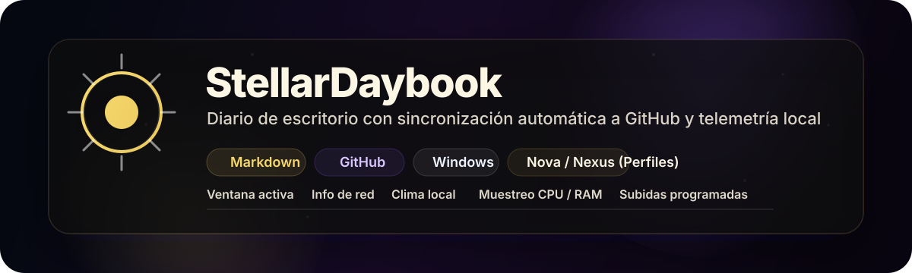
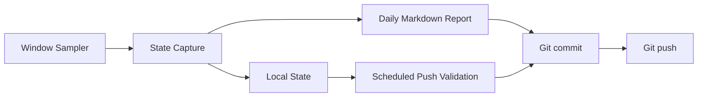
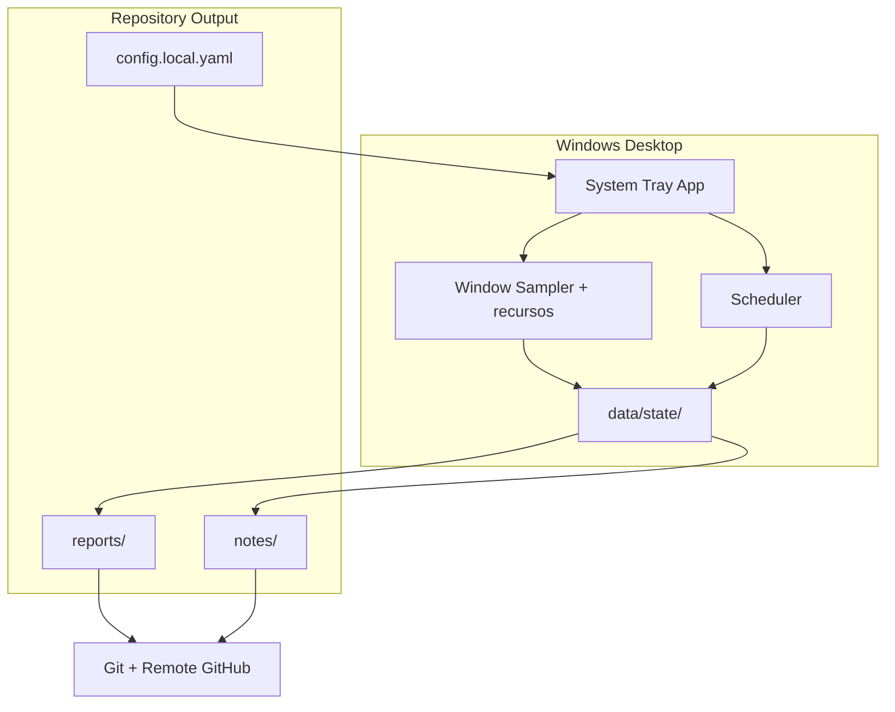
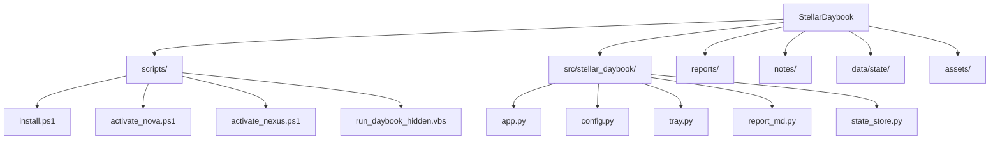

# StellarDaybook



StellarDaybook is a Windows desktop daily logger that generates daily Markdown reports, captures your machine's local context, and uploads the results to GitHub according to a set schedule.

It records:
- The active foreground window.
- Local network details.
- Local weather via Open-Meteo API.
- Approximate CPU and RAM usage.
- Work hour tags and activity heuristics.

It is designed to be lightweight, private by default, and easily readable when used as a public repository.

<p>
  
  
  
  
</p>

## At a Glance

| Area | What it does |
|---|---|
| Capture | Records active window, network, weather, and system load. |
| Report | Writes a daily Markdown report per machine inside `reports/`. |
| Sync | Fetches remote changes with a standard merge and uploads commits at scheduled intervals. |
| Privacy | Allows excluding specific window titles and processes from public logs. |
| Profiles | Supports independent local configurations: `Nova` and `Nexus`. |

## System Workflow



## Architecture



## Requisitos

- Windows 10 o 11
- Python 3.11+
- Git
- GitHub CLI (`gh`) if automatic uploads without manual credentials are desired.

## Quick Start

### 1. Install

```powershell
Set-ExecutionPolicy -Scope CurrentUser RemoteSigned -Force
.\scripts\install.ps1
```

### 2. Run Application

```powershell
pythonw -m stellar_daybook
```

To debug showing the console:

```powershell
python -m stellar_daybook --console
```

To generate a single test report and upload immediately:

```powershell
python -m stellar_daybook --once
```

## Desktop Profiles

The `Nova` and `Nexus` profiles share the same codebase but use different local activation files.

| Profile | Target Device | Activation |
|---|---|---|
| `Nova` | Laptop | `scripts/activate_nova.ps1` |
| `Nexus` | Desktop PC | `scripts/activate_nexus.ps1` |

### Nova

```powershell
powershell -ExecutionPolicy Bypass -File "C:\Users\Jack\Documents\GitHub\Experimentos\StellarDaybook\scripts\activate_nova.ps1"
```

### Nexus

```powershell
powershell -ExecutionPolicy Bypass -File "C:\Users\pablo\OneDrive\Documents\GitHub\StellarDaybook\scripts\activate_nexus.ps1"
```

Both activation scripts:
- Create `config.local.yaml` if it does not exist.
- Install editable package inside `.venv` virtual environment.
- Start system tray app in background with `wscript`.
- Create a shortcut in Windows Startup folder for automatic boot.

## Scheduled Uploads

| Day | Local Interval (Chile) |
|---|---|
| Every day | 13:30 - Lunchtime |
| Monday to Thursday | 17:20 - End of day |
| Friday | 16:25 - End of day |

If active tracking time is below the minimum threshold, scheduled push skips commit and logs attempt locally.

Before uploading, agent runs `git pull --no-rebase` to integrate changes from other machines without rewriting history. If pull or push fails, capture is removed so next interval attempts cleanly.

## Data Layout

```text
reports/              Daily reports per machine (`YYYY-MM-DD_Nova.md`, `YYYY-MM-DD_Nexus.md`).
notes/                Optional notes that can be uploaded alongside reports.
data/state/           Local State y registros (logs) del agente.
assets/               Presentation banner and visual assets.
src/stellar_daybook/  Application source code.
```

## Configuration

`config.local.yaml` overrides `config.example.yaml` and is excluded from version control.

Typical overrides:
- Machine name.
- Preset pause settings.
- Weather location.
- Privacy filters.
- Scheduler timers.

## Privacy Note

This repository is designed to be public, so keep sensitive information out of commits in:
- `notes/`
- `data/state/`
- Window title exclusions that are overly broad or overly specific.

## Repository Structure



## License

Personal use. Adjust license before publishing or redistributing.
