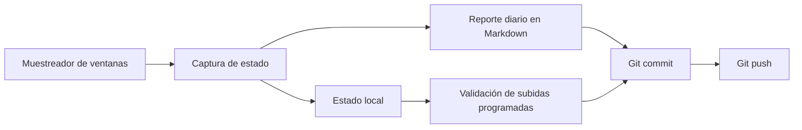
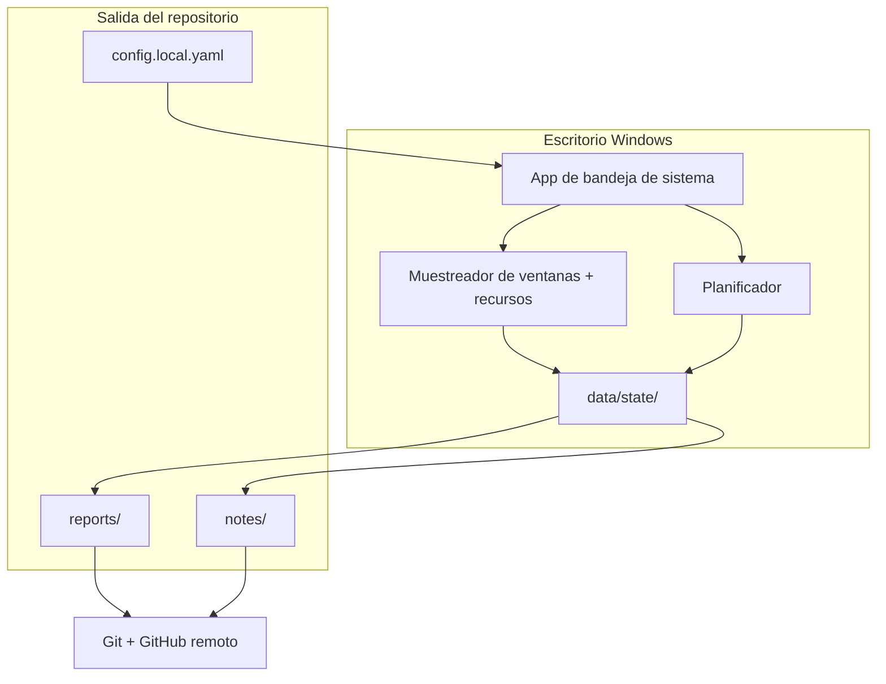
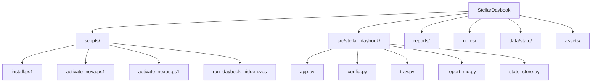

# StellarDaybook


StellarDaybook es un diario de escritorio para Windows que genera un reporte diario en Markdown, captura el contexto local de tu máquina y sube el resultado a GitHub según una programación establecida.

Registra:
- La ventana activa en primer plano.
- Detalles de la red local.
- Clima local a través de la API de Open-Meteo.
- Uso aproximado de CPU y RAM.
- Etiquetas de horas laborales y heurísticas de actividad.

Está diseñado para ser ligero, privado por defecto y fácilmente legible si se utiliza como repositorio público.

<p>
  
  
  
  
</p>

## A simple vista

| Área | Qué hace |
|---|---|
| Captura | Registra la ventana activa, red, clima y carga del sistema. |
| Reporte | Escribe un reporte diario por máquina en formato Markdown dentro de `reports/`. |
| Sincronización | Baja cambios remotos con merge normal y luego sube commits cuando se alcanzan los intervalos programados. |
| Privacidad | Permite excluir títulos de ventanas y procesos específicos de los registros públicos. |
| Perfiles | Soporta configurations locales independientes: `Nova` y `Nexus`. |

## Flujo del sistema



## Arquitectura



## Prerequisites

- Windows 10 o 11
- Python 3.11+
- Git
- GitHub CLI (`gh`) si deseas subidas automáticas sin ingresar credenciales manualmente.

## Inicio rápido

### 1. Instalar

```powershell
Set-ExecutionPolicy -Scope CurrentUser RemoteSigned -Force
.\scripts\install.ps1
```

### 2. Ejecutar la aplicación

```powershell
pythonw -m stellar_daybook
```

Para depurar mostrando la consola:

```powershell
python -m stellar_daybook --console
```

Para generar un único reporte de prueba y subirlo de inmediato:

```powershell
python -m stellar_daybook --once
```

## Perfiles de escritorio

Los perfiles `Nova` y `Nexus` comparten la misma base de código pero utilizan diferentes files de activación local.

| Perfil | Dispositivo objetivo | Activación |
|---|---|---|
| `Nova` | Computadora portátil | `scripts/activate_nova.ps1` |
| `Nexus` | Computadora de escritorio | `scripts/activate_nexus.ps1` |

### Nova

```powershell
powershell -ExecutionPolicy Bypass -File "C:\Users\Jack\Documents\GitHub\Experimentos\StellarDaybook\scripts\activate_nova.ps1"
```

### Nexus

```powershell
powershell -ExecutionPolicy Bypass -File "C:\Users\pablo\OneDrive\Documents\GitHub\StellarDaybook\scripts\activate_nexus.ps1"
```

Ambos scripts de activación:
- Crean `config.local.yaml` si no existe.
- Instalan el paquete editable dentro del entorno virtual `.venv`.
- Inician la aplicación de la bandeja del sistema en segundo plano con `wscript`.
- Crean un acceso directo en la folder de Inicio de Windows para su arranque automático.

## Subidas programadas

| Día | Intervalo local (Chile) |
|---|---|
| Todos los días | 13:30 - Almuerzo |
| Lunes a Jueves | 17:20 - Fin de jornada |
| Viernes | 16:25 - Fin de jornada |

Si el tiempo de tracking activo es inferior al umbral mínimo configurado, la subida programada omite el commit y solo registra el intento a nivel local.

Antes de subir, el agente ejecuta `git pull --no-rebase` para incorporar cambios de otras máquinas sin reescribir historial. Si el pull o el push fallan, se remueve la captura para que el siguiente intervalo intente realizar el proceso de forma limpia.

## Distribución de datos

```text
reports/              Reportes diarios por máquina (`YYYY-MM-DD_Nova.md`, `YYYY-MM-DD_Nexus.md`).
notes/                Notas opcionales que se pueden subir junto con los reportes.
data/state/           Estado local y registros (logs) del agente.
assets/               Banner de presentación y recursos visuales.
src/stellar_daybook/  Código fuente de la aplicación.
```

## Configuration

El archivo `config.local.yaml` sobrescribe a `config.example.yaml` y no se incluye en el control de versiones.

Sobrescrituras típicas:
- Nombre de la máquina.
- Ajustes preestablecidos de pausa.
- Ubicación para el clima.
- Filtros de privacidad.
- Temporizadores del planificador.

## Nota de privacidad

Este repositorio está diseñado para ser público, por lo que debes mantener fuera de los commits la información sensible en:
- `notes/`
- `data/state/`
- Exclusiones de títulos de ventanas demasiado amplias o demasiado específicas.

## Estructura del repositorio



## License

Uso personal. Ajustar la licencia antes de publicar o redistribuir.
