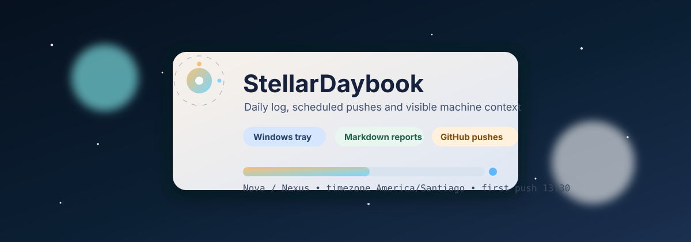
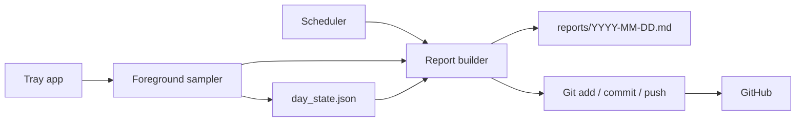
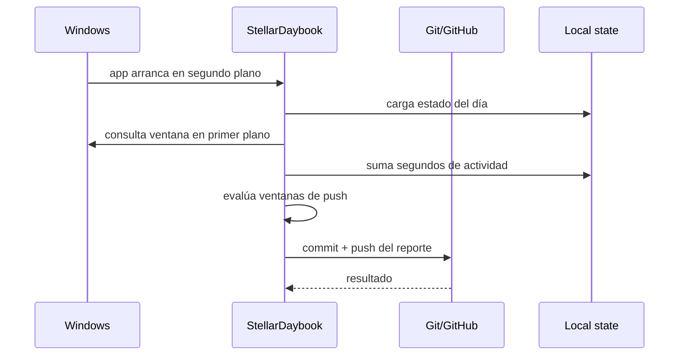

# StellarDaybook



StellarDaybook es una bitácora diaria para Windows que registra actividad del PC en Markdown, arma reportes por día y hace commits/pushes programados a GitHub con contexto útil: ventana en primer plano, red local, clima, uso aproximado de CPU/RAM y etiquetas de jornada.

Está pensado para usarse en dos máquinas:

- `Nexus`, el desktop de este PC.
- `Nova`, la laptop.

## Qué Hace

- Toma muestras del proceso en primer plano desde la bandeja del sistema.
- Resume la actividad diaria en `reports/YYYY-MM-DD.md`.
- Anexa instantáneas de cada push con red, clima y recursos del sistema.
- Hace commits y `git push` cuando se cumplen las ventanas horarias.
- Pausa el muestreo por minutos predefinidos desde el icono de bandeja.

## Inicio Rápido

### 1. Instalar

```powershell
Set-ExecutionPolicy -Scope CurrentUser RemoteSigned -Force
.\scripts\install.ps1
```

Ese script:

- crea `.venv` si hace falta,
- instala las dependencias,
- crea `config.local.yaml` si no existe,
- y fija una identidad local de Git si este PC todavía no tenía `user.name` / `user.email`.

### 2. Elegir máquina

En este PC usa:

```powershell
.\scripts\activate_nexus.ps1
```

En la laptop usa:

```powershell
.\scripts\activate_nova.ps1
```

Ambos scripts:

- dejan `config.local.yaml` con la máquina correcta,
- reinstalan el entorno editable,
- lanzan el agente oculto con `wscript`,
- y crean un acceso directo en la carpeta Inicio de Windows.

### 3. Probar un informe

```powershell
.\.venv\Scripts\python.exe -m stellar_daybook --once
```

## Uso Diario

### Agente en bandeja

```powershell
pythonw -m stellar_daybook
```

### Depuración en consola

```powershell
python -m stellar_daybook --console
```

### Informe manual + push

```powershell
python -m stellar_daybook --once
```

## Flujo



## Cómo Funciona



## Estructura

```text
assets/           banner SVG animado del README
data/state/       estado local y logs del agente
notes/            notas manuales que también viajan al commit
reports/          reportes diarios generados en Markdown
scripts/          instalación, activación y arranque oculto
src/stellar_daybook/
```

## Configuración

`config.example.yaml` es la base. `config.local.yaml` la sobreescribe y no se versiona.

Campos clave:

- `machine.name`: `Nexus` o `Nova`.
- `timezone`: zona horaria usada en los reportes.
- `schedule`: ventanas horarias de push.
- `weather`: coordenadas y etiqueta del clima.
- `privacy`: exclusiones de procesos y títulos de ventana.

## Requisitos

- Windows 10/11.
- Python 3.11 o superior.
- Git.
- GitHub CLI (`gh`) si quieres usar `gh auth setup-git` para pushes sin PAT.

## Solución De Problemas

- Si no hay `config.local.yaml`, ejecuta `.\scripts\install.ps1` o uno de los scripts de activación.
- Si Git no tenía identidad local, `install.ps1` la configura automáticamente con el usuario de Windows.
- Si el push falla por red o autenticación, el reporte se guarda localmente y se reintenta en la próxima ventana.

## Licencia

Uso personal. Si lo publicas o redistribuyes, ajusta la licencia según tu necesidad.
